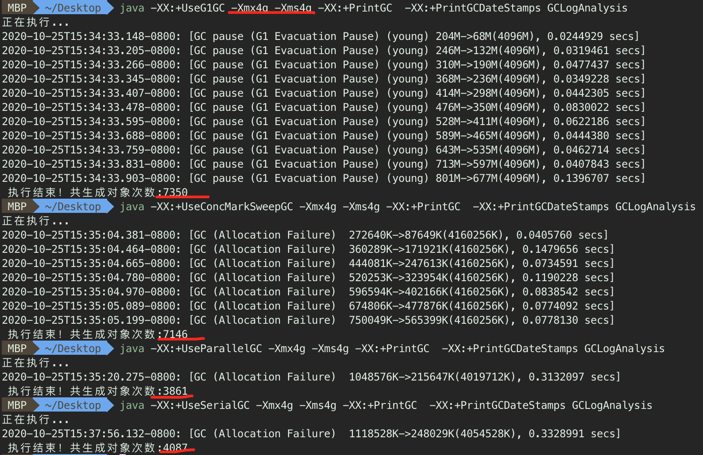

学习笔记

#### 总结
* 在第二个操作的时候，几种GC策略在相同大小的堆内存时，用wrk压测显示的 QPS 大小相差不大，这个比较疑惑，不知道是不是我压测的方式不对，还是说确实就是应该这样，反而用第一个例子创建对象的数量更好的体现了几种GC策略不同而导致的差异

1. 串行 GC
    * 从GC日志上可以看出，GC的耗时较长
    * 在堆内存较小的时候串行GC的效果好，我设置-Xmx56m的时候这个很明显，QPS比其他GC策略高
    * 串行GC的在内存较小的情况下GC效率更高，而其他的GC策略因为GC的过程比较复杂，所以在内存小的情况下反而不是很理想
    * 在堆内存较大的情况下，串行GC的效果就不好了，因为每次GC都需要STW，因为需要回收的空间比较大，所以暂停业务线程的时间较久，从而导致了GC效率不是很高
2. 并行 GC
    * jdk8及以下一些版本的默认GC策略
    * 并行GC也称为吞吐量优先GC，因为这个GC策略的关注点就是尽可能缩短STW时间，还有自适应动态调整GC参数的功能
    * 因为关注的是吞吐量，所以在第二个测试中理论上在大堆中的测试会比CMS的较好，在实际测试过程中确实发现好了一点，但是并不是特别明显，大概多了7%左右
3. CMS GC
    * 主要是老年代的垃圾回收策略，年轻代配合ParNew（串行GC的多线程版本）一起使用
    * 在第二个测试中，在大堆空间的情况下CMS没有很好的发挥作用，因为gateway应用在运行期间基本没有触发Full GC，所以基本都是Yong GC，所以测试的数据和并行GC还是有一点差距的
    * 在小堆空间情况下，确实发生了多次的fullGC，但是这个情况下串行GC反而效率更高，因为小空间就越简单的GC效率越高，对比起来CMSGC还是比串行GC复杂很多
4. G1 GC
    * jdk9以上的默认GC策略，G1 GC想做的是真的动态调节，把用户所设定的暂停时间作为目标去接近
    * G1 GC也很复杂，比CMS GC还要复杂，这点从看GC日志可以看出来
    * 在第二个测试中，G1 GC的效果比CMS稍好，但是和并行GC还是有差距的
    * G1 GC中的分区域回收的思想还是比较新的想法，当垃圾过多，但是用户设定的停顿时间又是固定的情况下，可以选择一些回收效率高的区域进行回收，只回收一部分区域，这样既达到了用户的需求，也回收了垃圾